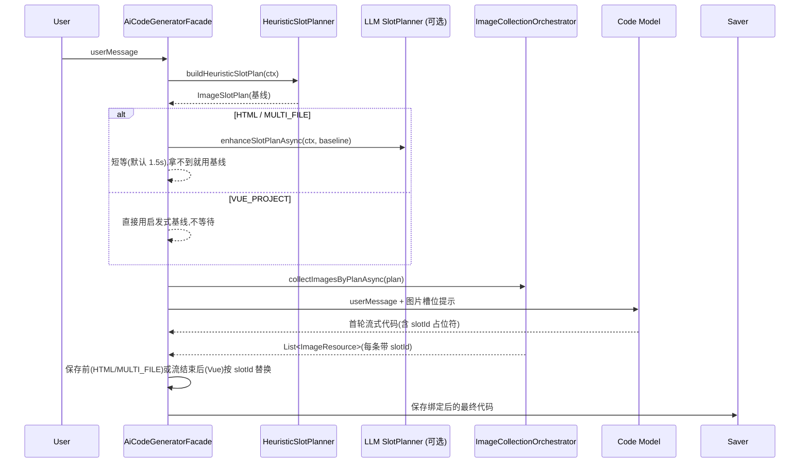

# 图片异步收集小改造设计文档

> 范围: `AiCodeGeneratorFacade` + `ImageCollectionOrchestrator` + 图片规划 prompt
> 状态: 先对齐设计,暂不改业务代码
> 目标: 保住首 token 速度,尤其保证 Vue 项目生成速度不明显降级,同时恢复"图片参与页面设计"的效果

---

## 一、背景与问题

`519abef` 将图片收集改为异步后,首轮流式生成不再等待图片收集,首 token 明显变快。但当前实现把图片信息完全移到了首轮生成之后:

- HTML / MULTI_FILE / Vue 首轮都只传原始 `userMessage`。
- 图片收集完成后再通过 `buildInjectionPrompt(images)` 发起第二轮生成。
- Vue 项目第二轮还会重新进入 reasoner + 工具调用链,成本高、耗时长、上下文也更容易被裁剪。

这导致模型在首轮设计页面时不知道有图片,会自然生成"无图布局、文字密集布局、SVG 占位或随意占位图"。第二轮再注入真实素材时,模型只能在既有结构里补图,容易出现硬塞、忽略、结构被重写或 Vue 二次生成成本过高。

核心矛盾不是"图片是否异步",而是:

> 首轮生成需要同步知道图片的设计意图,但不应该同步等待真实图片资源。

新的衡量标准:

> Vue 项目生成链路已经是 2-5 分钟级任务,任何新增 LLM 规划、二轮 reasoner、额外工具读写,都必须默认移出关键路径。

---

## 二、设计目标

1. Vue 项目热路径不新增图片规划 LLM 调用,不新增第二轮 reasoner,不新增默认工具修补链。
2. 首 token 不能回到同步收集时代的 1 分钟级等待;Vue 额外等待目标为 0 秒。
3. 首轮模型仍要知道页面有哪些图片位、分别用于什么区块、什么类别、什么比例和什么使用规则。
4. 真实图片搜索、Logo 生成、Mermaid 渲染继续异步执行,不阻塞首轮生成。
5. HTML / MULTI_FILE 可短等轻量槽位计划,但尽量不跑第二轮完整生成,通过确定性绑定把真实图片填入槽位。
6. 多轮修改场景中,图片规划不能只看当前追加 prompt,要结合已有应用上下文,但 Vue 上下文提取不能引入额外模型调用。
7. **"首轮 prompt 看到的槽位列表"和"后台真正去搜的素材列表"必须基于同一份 `slotId` 集合**,否则真实图片回不到对应槽位,绑定率必然为 0。
8. **图片绑定的失败模式必须可观测、可降级、不可泄露占位符到最终页面**。

非目标:

- 不重写整个 LangGraph 图片工作流。
- 不引入新的前端依赖。
- 不在本次小改造中做图片质量评分、视觉相似度过滤等重型能力。

---

## 三、总体方案

采用"分类型图片槽位 + 素材异步绑定"的两阶段方案:

1. HTML / MULTI_FILE: 请求进入后,**先本地启发式产出 `ImageSlotPlan`**,可选短等 LLM planner 增强,主流程不阻塞。
2. Vue: 不等待任何 LLM,直接用本地启发式生成极简 `ImageSlotHint`。
3. 首轮代码生成使用 `userMessage + 图片槽位提示`,要求模型预留稳定 `slotId` 占位符。
4. 后台基于**同一份 `slotId` 列表**异步收集真实素材,每条素材结果都要带回它属于哪个 `slotId`。
5. HTML / MULTI_FILE 在保存前将真实素材按 `slotId` 绑定到槽位;未命中槽位执行兜底。
6. Vue 在 TokenStream 完成回调中执行确定性 manifest / 文件级占位符替换,**不再调模型、不再触发工具链**。
7. 只有 HTML / MULTI_FILE 绑定失败或旧代码没有槽位时,才降级使用第二轮 injection;Vue 二轮 injection 默认关闭。

### 信息流一致性(新增)

为了避免"启发式槽位"和"LLM planner 派任务"两条信息流不一致导致绑定为 0:

- **`ImageSlotPlan` 是唯一真源**。它在请求进入时第一时间产出(本地启发式或本地启发式 + LLM 短等增强)。
- 真实素材收集任务由 `ImageSlotPlan` 派生 ——`collectImagesAsync` 必须接收 `ImageSlotPlan`,不再独立调用 `imageCollectionPlanService` 自己生成 plan。
- 每条 `ImageResource` 必须新增 `slotId` 字段,贯穿 ImageSearchTool / UndrawIllustrationTool / MermaidDiagramTool / LogoGeneratorTool 的返回值。
- LLM planner(`ImageCollectionPlanService`)在新方案中**只用于在启发式 plan 之上做"增量增强"**(详见第七节),不再独立派任务。

### 简化时序



---

## 四、核心数据结构

新增轻量计划模型,建议命名为 `ImageSlotPlan`。

```java
public class ImageSlotPlan {
    private List<ImageSlot> slots;
    private String layoutGuidance;
    private SlotPlanSource source; // HEURISTIC / LLM_ENHANCED
}

public class ImageSlot {
    private String slotId;       // 稳定占位符,如 hero_main_1
    private String category;     // CONTENT / ILLUSTRATION / LOGO / ARCHITECTURE
    private String page;         // 页面或路由,如 home / about / contact
    private String section;      // 区块,如 hero / product-card / workflow
    private String query;        // 搜索关键词或生成描述
    private String alt;          // alt 文案
    private String aspectRatio;  // 16:9 / 4:3 / 1:1 / logo
    private boolean required;    // 是否强依赖
}
```

设计要点:

- `slotId` 是首轮代码和后续绑定的合同,必须**稳定、短、可读**;命名规范统一为 `<section>_<role>_<seq>`,如 `hero_main_1`、`feature_card_2`。
- `layoutGuidance` 只写整体图片布局建议,不塞真实 URL。
- 旧的 `ImageCollectionPlan` 短期保留作为 LLM planner 的输出格式(见第七节),但不再作为派发收集任务的唯一来源 —— 必须先归一到 `ImageSlotPlan` 的 `slots` 上再派任务。
- Vue 热路径只使用 `ImageSlot` 的子集字段:`slotId / category / page / section / alt / aspectRatio`,不在首轮等待 `query` 精细化。
- Vue 默认每次最多 3 个槽位,避免 prompt 变长导致 reasoner 输入膨胀。

`ImageResource` 必须扩展:

```java
public class ImageResource {
    // 既有字段:url / description / category ...
    private String slotId;       // 新增:对应 ImageSlotPlan 中的 slotId
}
```

收集工具(`ImageSearchTool` 等)的接口签名调整为接收 `ImageSlot`,在返回的每条 `ImageResource` 上回填 `slotId`。

---

## 五、Prompt 改造

### 1. 图片规划 prompt(LLM planner)

将现有 `image-collection-plan-system-prompt.txt` 从"独立任务计划"改写为"基于已有启发式 `ImageSlotPlan` 做增量增强"。

输入约定:

- 输入除了 `userMessage` 外,新增 `已有启发式槽位 JSON`、`应用摘要`、`已有页面列表`、`本轮修改范围`(详见第八节)。
- 输出仍然是 JSON,但每个任务必须显式带上 `slotId`,且 `slotId` 必须来自启发式列表或新加的、命名规范一致的 slot。

新增要求:

- 每张图必须绑定明确的 `slotId`。
- 必须说明页面/区块/用途。
- 营销站、企业官网、电商、个人页默认不要生成架构图。
- 多轮修改时,若当前需求只是"加联系页",只为新增/受影响页面规划槽位。
- **该 prompt 只用于 HTML / MULTI_FILE 的可选增强;Vue 不在热路径调用。**
- **如果 LLM planner 在超时窗口内未返回,使用启发式基线;不能阻塞首轮生成。**

### 2. 代码生成 prompt

首轮传入增强后的轻量 prompt,格式示例:

```text
## 图片设计槽位
请在页面设计阶段为以下图片槽位预留自然位置。真实图片稍后绑定,当前不要随意编造图片 URL。

- slotId: hero_main_1
  category: CONTENT
  page: home
  section: hero
  aspectRatio: 16:9
  alt: 智能应用生成平台工作台预览
  usage: 首页首屏主视觉,需要留出大图区域

占位规则(必须严格遵守):
- HTML : src="__IMG_SLOT_hero_main_1__"
- Vue : :src="imageAssets.heroMain1.url" 或 src="__IMG_SLOT_hero_main_1__"
- CSS background-image: background-image: url("__IMG_SLOT_hero_main_1__")
- 不允许使用 picsum.photos / unsplash 直链 / data: 协议 / 任何随机图作为槽位的替代
- 不允许把占位符出现在 HTML 注释、JS 字符串拼接或模板字面量中
```

同时修改原生成 prompt 中"缺少图片可用 picsum.photos"的默认策略:

- 如果存在图片槽位,优先使用槽位占位符。
- 只有没有任何槽位,或某个非必需槽位最终无素材时,才允许使用 `picsum.photos`。

### 3. 占位符强约束机制

模型软约束不可靠,补一组确定性兜底:

- 后端在保存前用统一正则匹配 `__IMG_SLOT_([a-z0-9_]+)__`,匹配范围覆盖:
  - `src="…"` / `src='…'` / `src={`…`}` / `:src="…"`
  - `url(...)` / `url('...')` / `url("...")`
  - 普通文本节点(允许出现在 alt/title/data-* 中,以便模型多场景遵循)
- 未在 plan 中的 slotId 出现时:按"未知占位符"处理,降级到 `picsum.photos` 兜底图。
- plan 中存在但代码里没出现的 slotId:不强制修复,只记日志(纳入"绑定率"指标)。
- 占位符泄露最终保存前必须执行二次扫描:**保存前若仍残留 `__IMG_SLOT_*__`,统一替换为兜底 URL,绝不允许泄露到生产页面**。

### 4. Token 预算

最近改动 `9a1a15c` 已经限制每条消息字符上限和 token 预算,槽位提示的注入必须遵循:

- Vue 首轮 prompt 的槽位提示总长度不超过 800 字。
- HTML / MULTI_FILE 首轮 prompt 的槽位提示总长度不超过 1500 字。
- 槽位提示在历史消息裁剪逻辑中**计入"系统级追加",不参与历史压缩**(放置在 systemMessage 末尾或 userMessage 头部固定位置)。
- 注入前后必须重新计算 token 预算,若超限则削减槽位数量(从 LOGO/ILLUSTRATION 开始砍)。

---

## 六、各生成类型接入方式

### 1. HTML

首轮:

- `generateHtmlCodeStream(promptWithSlots)`
- 生成结果中包含 `__IMG_SLOT_xxx__`。

保存前:

- 解析前先执行 `bindImagesToSlots(html, slots, images)`。
- 将 `src="__IMG_SLOT_xxx__"`、`url("__IMG_SLOT_xxx__")` 等所有变体替换为真实 URL。
- 同时补全/修正 `alt`。
- 残留占位符走兜底替换(picsum)。

兜底:

- 若未出现任何槽位,但图片已收集到,可以保留现有 injection 作为降级路径。

### 2. MULTI_FILE

首轮:

- `index.html` / `style.css` 里使用同样槽位占位符。

保存前:

- 对三个代码块分别绑定。
- 支持 HTML `src` 和 CSS `url(...)` 三种引号变体的替换。

兜底:

- 同 HTML,仅在槽位缺失或绑定率过低时触发 injection。

### 3. VUE_PROJECT

速度优先原则:

- 不等待 `planImageSlotsAsync`。
- 不调用 `imageCollectionPlanService` 做同步图片规划。
- 不默认触发 `generateVueProjectCodeStream(appId, injectionPrompt)` 第二轮。
- 不默认用工具链读取/修改多个 Vue 文件来补图。

首轮:

- 由 Java 本地启发式生成最多 3 个图片槽位,直接拼入 Vue 首轮 prompt。
- prompt 建议创建 `src/data/imageAssets.js`,但不把它作为强制失败条件。
- 页面组件引用 `imageAssets.xxx.url`,不要硬编码随机图片。
- 如果模型未创建 registry,允许先使用槽位字符串或稳定 fallback 图,不要立刻触发二轮修复。

推荐 manifest:

```javascript
export const imageAssets = {
  heroMain1: {
    url: "__IMG_SLOT_hero_main_1__",
    alt: "智能应用生成平台工作台预览"
  }
}
```

#### Vue 落盘后替换的接入点(原文档缺失,新增)

Vue 通过 `WriteFileTool` 在工具调用回路中直接写文件到磁盘,facade 没有"流结束统一保存"的天然位置。需要新增以下接入点:

1. **触发点**: 在 `processVueStreamWithInjection` 末尾给首轮流追加 `.doOnComplete(() -> applyVueSlotBindings(appId, slotPlan, images))`,而不是在原 onCompleteResponse 内做(后者是 langchain4j TokenStream 的回调,触发太早,工具链可能仍在写文件)。
   - 注意:`doOnComplete` 仅在所有流元素发出后触发,要保证图片 future 在此之前已经 join 完(用 `Mono.fromCallable(waitImages).subscribeOn(boundedElastic)` 拼接到流末尾)。
2. **目录定位**: 复用现有 Vue 工具链的工程根目录推算逻辑(基于 `appId` → `tmp/code_output/vue_project_<appId>/`),抽成 `VueProjectPathResolver` 共用。
3. **替换范围**:
   - 优先扫 `src/data/imageAssets.js` 做 manifest URL 替换。
   - 同时对整个 `src/` 目录递归扫 `.vue / .js / .ts / .css` 文件,正则替换 `__IMG_SLOT_*__`(防止模型没建 manifest 而是直接在组件里写占位符)。
   - 残留占位符强制替换为兜底 URL,不允许泄露。
4. **失败策略**:
   - 替换失败只写日志 + 记录绑定率指标,不抛异常、不触发二轮 injection、不再调模型。
   - 如果整个工程目录扫不到任何 `__IMG_SLOT_*__`,说明模型完全没遵守占位符约定,本轮放弃图片绑定,记录"模型未遵从槽位"指标用于回归观察。

#### Vue 二轮 injection 默认关闭的副作用确认

- 默认关闭后,Vue 项目获得真实图片完全依赖"模型按占位符输出 + 后端确定性替换"两个条件同时成立。
- 早期上线建议**先以"灰度"形式打开 manifest 替换,观察绑定率**(目标 ≥ 70%),低于阈值时把 `enableImageInjectionSecondRound` 临时拉回 true,作为兜底;稳定后再永久关闭。
- 这是一个产品级权衡(速度 > 图片完整度),需要在上线前与产品方明确对齐。

### 4. 同步路径 `generateAndSaveCode`(新增)

当前 `generateAndSaveCode`(非流式)走 `enhancePromptWithImages` 同步收集后再传给模型。本次改造收敛为:

- 同步路径同样走启发式 `ImageSlotPlan`,首轮 prompt 带槽位提示。
- 同步路径下,因为没有"首 token 速度"压力,允许等待真实素材收集完成后做 `bindImagesToSlots`,本质等同于把异步链路串行化执行。
- 不再保留单独的 `enhancePromptWithImages` 拼接图片到 prompt 末尾的旧逻辑,统一收口到槽位机制,避免两套图片处理路径。

---

## 七、超时与降级策略

### LLM planner 的去留

`imageCollectionPlanService.planImageCollection` 当前是 reasoner 模型,p50 3-10s。在 2 秒短等下基本永远超时。本次改造的取舍:

- **首选方案 A:LLM planner 退役**。完全用启发式基线 + 多轮上下文(第八节)替代,实现最简单,行为最稳定。
- **备选方案 B:换小模型(haiku/小 Sonnet)** 做"增量增强",超时窗口设 1.5s,只允许它**追加** 槽位或细化 `query`,不允许覆盖启发式 slotId。
- **不推荐:保留 reasoner**。等 2 秒命中率低,等更长就违背设计目标 2。

第一期建议直接走方案 A;若线上启发式效果不足,再以方案 B 增量上线。

### 等待预算

| 阶段 | HTML / MULTI_FILE | VUE_PROJECT | 失败后行为 |
| --- | --- | --- | --- |
| 启发式槽位 | 同步本地生成(<10ms) | 同步本地生成(<10ms) | 不会失败 |
| LLM 增强(可选) | 1.5s | 不调用 | 使用启发式基线 |
| 真实素材收集 | 不阻塞首轮 | 不阻塞首轮,不阻塞最终响应 | 保存前/流结束后能拿到就绑定,拿不到就保留兜底 URL |
| 绑定 / manifest 替换 | 保存前确定性绑定 | 流结束后确定性扫描替换 | 替换失败仅记录日志,占位符强制替换为兜底 URL |
| injection 兜底 | 仅 HTML/MULTI_FILE,绑定率 < 阈值时短等 | 默认关闭(灰度期可临时打开) | 失败保留首轮 |

### 启发式基线规则

启发式槽位计划必须很简单,尤其 Vue 不能做复杂上下文推理:

- 官网/产品站: `hero_main_1`, `feature_1`, `feature_2`, `logo_1`
- 电商: `hero_product_1`, `product_card_1..4`
- 博客/内容站: `article_cover_1`, `category_card_1..3`
- 联系页修改: `contact_hero_1` 或不新增图片

启发式分桶来源:

- 优先使用应用元数据(行业 / 站点类型,见第八节持久化)。
- 次选关键词命中(`userMessage` + 应用标题)。
- 兜底:`hero_main_1` + `feature_1`(最少 1 个,最多 2 个),不抛"零槽位"。

Vue 额外收敛:

- 默认只保留 `hero_main_1`,必要时加 `feature_1` 和 `logo_1`。
- 不生成 Mermaid 架构图槽位,除非用户明确要求技术架构页。
- 不同步生成 Logo;Logo 真实生成只能走后台异步或使用文字 Logo。

---

## 八、多轮对话处理与槽位持久化

### 持久化(原文档缺失,新增)

"复用已有 slotId" 需要持久化历史槽位,设计如下:

- 在应用元数据表(或新增 `app_image_slot` 表)中保存:
  - `app_id`、`slot_id`、`category`、`page`、`section`、`alt`、`aspect_ratio`、`required`、`last_used_at`、`last_url`
- 每次首轮规划完成后,把 `ImageSlotPlan.slots` 写入 / upsert 一次。
- 每次素材绑定成功后,把命中 slot 的真实 URL 写到 `last_url`,下一轮可直接复用,**避免重复搜索同样的图**。
- 启发式 planner 在生成槽位前先读这张表,优先返回"已有 slotId"列表;只为新增页面/新增区块创建新 slotId。

短期可先从已有内存或已保存元信息提取最小上下文(如果还未引入新表):

- app 名称/行业/主题
- 已有页面列表
- 当前生成类型
- 最近一轮用户原始需求摘要

### Planner 输入约定

```text
用户本轮需求: ...
应用摘要: ...
已有页面/路由: ...
已有图片槽位: ...
本轮修改范围: ...
```

Vue 限制:

- 不为了图片规划额外调用总结模型。
- 不为了图片规划扫描整个 Vue 工程目录。
- 如果缺少上下文,直接按本轮 prompt 启发式生成 0-3 个槽位,但**至少保留兜底 1 个**(避免 Vue 永远无图)。

原则:

- 新增页面只规划新增页面需要的槽位。
- 修改已有页面时复用已有 `slotId`,不要无意义生成新图片。
- 用户明确要求替换视觉素材时才重新规划对应槽位。

---

## 九、实现步骤

### Step 1: 增加槽位计划模型与 ImageResource.slotId

- 新增 `ImageSlotPlan` / `ImageSlot` / `SlotPlanSource`。
- 在 `ImageResource` 上新增 `slotId` 字段。
- 在 `ImageCollectionOrchestrator` 增加 `buildHeuristicSlotPlan(ctx)`、`collectImagesByPlanAsync(plan)`。
- 暂时保留 `collectImages` / `collectImagesAsync` 老签名作为过渡,但内部改为先调启发式 plan,再调 `collectImagesByPlanAsync`。
- 启发式方法不得调用模型。

### Step 2: 槽位 → 收集任务派发

- 根据 `ImageSlot.category` 派发到现有工具:
  - CONTENT -> `ImageSearchTool`
  - ILLUSTRATION -> `UndrawIllustrationTool`
  - ARCHITECTURE -> `MermaidDiagramTool`
  - LOGO -> `LogoGeneratorTool`
- 修改各工具方法签名,让返回的 `ImageResource` 都带回 `slotId`。
- 一个 slot 在收集失败时:不抛异常,只在最终结果中缺失这条 slotId,后续走占位符兜底替换。

### Step 3: 槽位持久化与多轮上下文

- 设计 `app_image_slot` 表(或复用现有应用元数据存储)。
- `ImageCollectionOrchestrator.buildHeuristicSlotPlan` 增加从持久层读已有 slot 的逻辑。
- 绑定结果回写 `last_url`。
- 这一步**与 Step 1-2 解耦**:第一期可先不持久化,所有 slot 当作"本次新建",验证完整链路后再补持久化。

### Step 4: 首轮 prompt 带槽位

- HTML / MULTI_FILE: 在 `generateAndSaveCodeStream` 中产出启发式 plan,可选短等 1.5s LLM 增强。
- Vue: 直接使用启发式 plan,0 秒等待。
- 使用 `buildPromptWithImageSlots(userMessage, slotPlan)` 替代裸 `userMessage`,Vue 版本必须更短(≤800 字)。
- 同步路径 `generateAndSaveCode` 同样接入启发式 plan,移除旧的 `enhancePromptWithImages` 直接拼接逻辑。

### Step 5: 占位符替换与兜底

- 实现 `bindImagesToSlots`:
  - 输入:代码字符串 + `ImageSlotPlan` + `List<ImageResource>`(都带 slotId)。
  - 用统一正则覆盖 `src` / `url(...)` / Vue `:src` / 文本节点等所有变体。
  - 命中:替换为真实 URL,补全 alt。
  - plan 中存在但未命中代码的 slot:记录"模型未遵从"指标。
  - 代码中未在 plan 的 slotId:降级 picsum。
  - 残留 `__IMG_SLOT_*__`:统一替换为兜底 URL,**绝不放行**。
- HTML / MULTI_FILE 在 `processCodeStreamWithInjection.doOnComplete` 中调用。
- Vue 在 `processVueStreamWithInjection` 末尾通过 `VueProjectPathResolver` 定位工程目录,递归扫 `src/` 做替换。

### Step 6: 收缩 injection 使用范围

- HTML / MULTI_FILE: 只有"绑定率 < 50% 且首轮无法满足必要槽位"才触发短等二轮 injection。
- Vue: 默认关闭完整二轮 injection;灰度期允许通过开关 `enableImageInjectionSecondRound` 临时打开。

### Step 7: 指标与观测

- 上报每次生成的 `slotPlanSize` / `bindHitCount` / `bindRate` / `placeholderLeakCount`。
- 落到现有日志体系(暂不要求新建监控大盘),便于灰度期复盘。

---

## 十、验证清单

功能验证:

- HTML 首轮输出中包含 `__IMG_SLOT_...__`,保存后的文件中被替换为真实 URL。
- MULTI_FILE 的 HTML/CSS 槽位都能被替换,三种引号变体均覆盖。
- Vue 首轮尽量生成 `imageAssets.js`;若已生成,流结束后 manifest 被替换;若未生成,组件中直接写的占位符也被替换。
- 图片收集超时时,首轮仍能正常完成并保存,残留占位符被兜底 URL 替换。
- 无图片需求的 prompt 不应强行加图(启发式至少返回 1 个兜底也允许,但绑定时按 required=false 处理)。
- Vue 即使没有生成 `imageAssets.js`,也不能自动触发第二轮 reasoner。
- 多轮对话:第二轮要求"加联系页",历史 slot 被复用,只新增 contact 相关 slot。

效果验证:

- 首页 Hero / 卡片 / 内容区在首轮布局时已预留图片空间。
- 不再大量出现无关 Mermaid 架构图。
- 图片绑定失败时页面不崩,alt 和占位策略可接受。
- 任何场景下保存的最终代码不含残留 `__IMG_SLOT_*__`。

性能验证:

- HTML / MULTI_FILE 首 token 等待只包含槽位计划短等待,目标控制在 1.5 秒额外预算内(LLM 增强方案);若走方案 A,额外等待 < 50ms。
- Vue 首 token 额外等待目标为 0 秒;只允许本地字符串拼接和启发式槽位生成。
- Vue 不再因为素材注入默认触发第二轮 2-5 分钟工具链。
- Vue 图片槽位提示长度不超过 800 字,默认槽位数不超过 3。

指标验证(灰度期):

- 整体绑定率 ≥ 70%(命中 slot 数 / plan slot 数)。
- 占位符泄露次数 = 0。
- "模型未遵从槽位"比例 ≤ 30%,超过则需要回看 prompt 强化。

回归验证:

```powershell
mvn test
```

如果测试范围过大,至少新增/运行以下单测:

- `ImageSlotPlan` JSON 解析测试
- `buildPromptWithImageSlots` 文本生成测试(HTML/Vue 两套长度上限)
- `bindImagesToSlots` HTML/CSS/Vue 三种引号变体替换测试
- 占位符泄露兜底测试(plan 给了但素材为空 → 残留必须被兜底 URL 替换)
- Vue manifest 与组件双扫描测试
- 多轮对话 slot 复用测试

---

## 十一、风险与控制

| 风险 | 控制方式 |
| --- | --- |
| 槽位计划本身也慢 | 启发式同步本地生成;LLM 增强 1.5s 超时;Vue 不等待 |
| 模型不按槽位输出 | prompt 强约束 + 后端正则覆盖 src / url / :src / 文本节点;统计绑定率 |
| 真实图片和槽位不匹配 | `ImageResource.slotId` 全链路传递,一槽一图 |
| Vue manifest 未生成 | 同时扫描 `src/` 目录所有文件做占位符替换,不只看 manifest |
| 多轮修改误加图片 | planner 输入带应用摘要、已有页面、本轮修改范围,持久化复用 slot |
| 占位符泄露到最终页面 | 保存前二次扫描 `__IMG_SLOT_*__`,残留强制兜底 URL |
| Vue prompt 变长导致 reasoning 变慢 | Vue 槽位提示限制 800 字以内,最多 3 个槽位;计入 token 预算 |
| LLM planner 永远超时 | 第一期直接退役;若启用,只做增强不做主规划 |
| 同步与流式两套图片处理路径 | 同步路径也接入槽位机制,移除旧的 `enhancePromptWithImages` 拼接 |
| 灰度期 Vue 绑定率过低 | 灰度期保留 `enableImageInjectionSecondRound` 开关,作为兜底 |

---

## 十二、推荐默认策略

短期最稳的默认值:

- `HTML_MULTI_IMAGE_SLOT_PLAN_LLM_ENHANCE_ENABLED = false`(第一期方案 A,退役 LLM planner)
- `HTML_MULTI_IMAGE_SLOT_PLAN_WAIT_MILLIS = 1500`(若启用 LLM 增强)
- `VUE_IMAGE_SLOT_PLAN_WAIT_MILLIS = 0`
- `IMAGE_INJECTION_WAIT_SECONDS` 只用于 HTML / MULTI_FILE 兜底,且仅在绑定率 < 50% 时触发
- Vue `enableImageInjectionSecondRound = false`(灰度期可临时 true)
- Vue 每轮最多 3 个图片槽位;HTML / MULTI_FILE 每页默认最多 3-5 个图片槽位
- 架构图默认关闭,除非用户明确要求技术架构/流程/原理展示
- Vue 不同步生成 Logo,不默认生成 Mermaid,不为了图片规划读取工程全量文件
- 占位符兜底 URL 走现有 picsum 配置,且必须保证 200 状态码

最终判断标准:

> 首轮代码已经为图片设计了位置;真实图片只是绑定资源,不是重新设计页面。

---

## 附录:本次修订相对原版的关键变化

1. **新增"信息流一致性"原则**:`ImageSlotPlan` 是唯一真源,收集任务从它派生,`ImageResource` 全链路带 `slotId`。
2. **LLM planner 默认退役**(方案 A),可选保留为"增量增强"(方案 B);不再接受 reasoner 在热路径。
3. **Vue 落盘后替换接入点展开**:在 `processVueStreamWithInjection` 末尾、通过 `VueProjectPathResolver` 定位、递归扫 `src/`。
4. **占位符强约束 + 兜底**:统一正则、绑定率指标、保存前二次扫描、残留必须替换为兜底 URL。
5. **同步路径接入**:`generateAndSaveCode` 也走槽位机制,消除两套图片处理路径。
6. **多轮 slot 持久化**:新增 `app_image_slot` 表(或复用元数据),启发式优先复用历史 slot。
7. **token 预算**:槽位提示长度限制(Vue 800,HTML/MULTI 1500),计入消息预算。
8. **灰度策略**:Vue 二轮 injection 在灰度期保留开关,绑定率 ≥ 70% 后再永久关闭。
